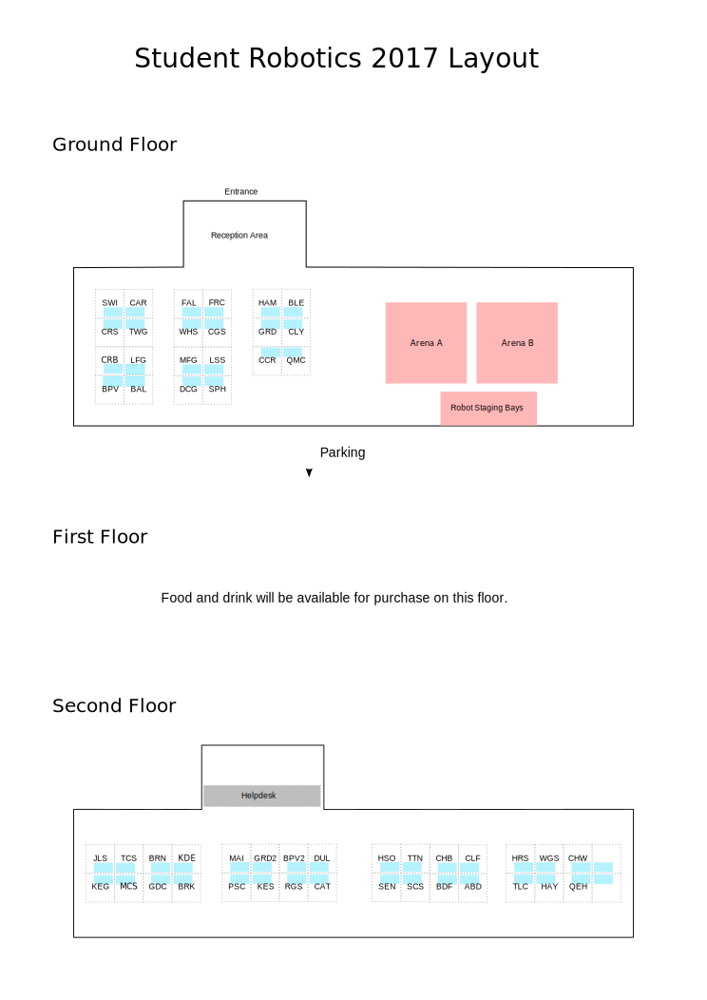

---
original:
  authors: Sean Bedford
  url: https://github.com/srobo/comp-team-coord-docs/ProcessDocs/orientationAndPitRules
---
## Welcome to Student Robotics 2017!

## Pit Rules and Guidance
The following rules must be observed at all times in the pits:

1.	No battery charging. You must hand over your battery charger and spare batteries at reception. During the competition, visit Helpdesk (on the top floor, see map) to swap a discharged battery for a charged one.
2.	No liquids except drinks to be present on the top floor. The carpet is expensive, and easily damaged by adhesives / paint / solvents.
3.	No powered tools on the top floor (such as soldering irons). **Power tools should only be used in the downstairs area.**
4.	Keep your robot in your pit when possible – we may need to find you quickly.
5.	Please avoid blocking or restricting aisles through pits.
6.	Please refrain from running any wireless access points, they will only interfere with the AP next to your pit

## Network and Website Details
A wireless network is available, connection details:

* **SSID:** SR
* **Password:** easyasabc

You will find the following pages on the website useful:

[http://srobo.org/comp/schedule]() The schedule of matches.

[http://srobo.org/comp/league]() The current league scores.

[http://srobo.org/comp/team]() Statistics about your team and others.

## Schedule

**Saturday 1/4/2017 (Day 1)**

| Time | Activity |
| ---- | -------- |
| 9:00 | Doors open |
| 9:30 | Introduction and Safety briefing: **All team members and team leaders must attend this briefing which will be held at arena A** |
| 9:45 | Tinkering time |
| 11:15 | League matches |
| 12:15 | Lunch and Tinkering time |
| 13:00 | League matches |
| 17:30 | End of day |

**Sunday 2/4/2017 (Day 2)**

| Time | Activity |
| ---- | -------- |
| 9:00 | Doors open |
| 9:30 | League matches |
| 12:15 | Lunch |
| 13:15 | League matches |
| 14:30 | Competition Photo: Everyone will be gathered together with their robots for a photo. |
| 14:45 | Knockout matches |
| 17:00 | End of Knockout matches |
| 17:15 | Prize Ceremony |
| 18:00 | End of day |

## Tinkering Time
During parts of the competition scheduled as “Tinkering time”, the arenas will be open for robots to be tested in the competition environment. **You must book a slot in an arena in advance.** Approach the competition staging area (next to the arenas, see map) up to half an hour before and during sessions to request a slot.

## How the competition runs
Student Robotics features a series of league matches, then knockout rounds seeded by league scores. The schedule (on the website; see above link) defines when league matches will be for your team. You are responsible for bringing your robot to the arena, and taking part in the match:

1.	You **must** arrive at the competition staging area (next to the arenas, see map) with your robot at least 2 minutes before your match starts.
2.	Only your designated “robot wrangler” may enter the staging area.  They **must** be wearing a high vis jacket identifying your team.  You will receive this jacket once your robot has been checked to be compliant with the regulations in the rules.
3.	In the staging area, a special USB flash disk will be present to tell the robot which corner it starts in. You will need to insert this into your robot **before** powering on.
4.	Robot wranglers should turn your robot on **before** it enters the arena, so that it is ready to start on time.  The match will begin regardless of whether your robot is ready.
5.	Robots are started by the team member pressing the start button on the power board. Once pressed, the team member should step back to the edge of the crowd barrier.
6.	You may only enter the arena when given permission to do so by a match scoring official.
7.	If you wish to resign from a match whilst it is in play, you may signal to a match scoring official that you wish to “throw in the towel”.  They will then turn off your robot and you will forfeit that match.

### Getting help during the competition
For matters related to the operation of the competition (such as querying a score you disagree with), please approach the competition staging area and ask to speak to the Judge.  For all other enquiries, please visit Helpdesk on the top floor (see map).

We hope you have a fun competition!

