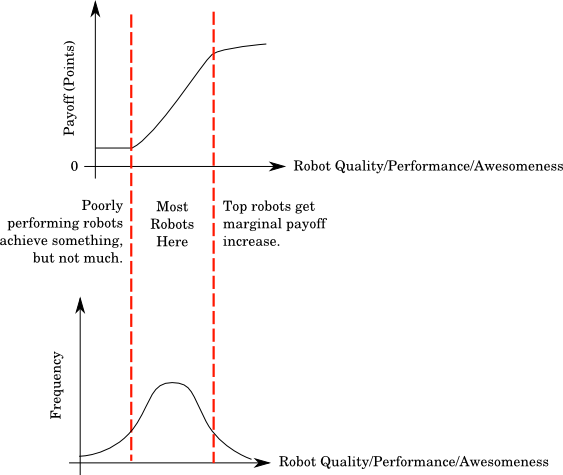

# Game Assessment Criteria

### 1. Low barrier to entry

The kit that we distribute is a lever with which we lower the barrier.

### 2. Target shape of performance versus payoff function

We can create three loose categories of robots:

1. Poor: We want these to still be able to score a few points, but not really achieve much beyond that.
2. Good: The game should aim to spread these robots out in points-space as much as possible.
3. Excellent: Matches between the awesome robots should be as close as possible. This makes the competition exciting, as it should lead to a close final.

### 3. Axes of exploration

There are three general engineering disciplines we want to provide as axes of exploration:

- Software
- Mechanics
- Electronics

The scope for development within these axes should be well-balanced. A team should not have to extensively explore all of these axes to compete.

### 4. Engineering goals should be encouraged

- Robot 'intelligence' and strategy.
- State. Robots that are more than just reflexive are more interesting.
- Reliability. Robots should not fall apart, software should not fall apart.
- Technical 'insanity'. Things that are technically advanced are awesome.

### 5. Games should be a spectacle

- Fun to watch.
- Fun to play.
- No conclusion: must be very unlikely to end before time is up, or result in stalemates.
- Continuous action: camping/sitting must not be encouraged.

### 6. Game must be a non-contact sport

Pushing, breaking, beating, etc. of other robots must not be encouraged.

### 7. Encourage competitive interaction

The behaviour of a robot should be influenced by that of others.

### 8. Encourage intent

Robots acting randomly (eg just doing random walks) should be discouraged.

### 9. Reproducible in schools

The game must be reproducible in schools without too much hassle.

### 10. Present a range of strategy options

There should be different paths available to victory. However:

- These paths should not be completely orthogonal from each other.
- The tasks should interact.
- No single route should be superior to others.

## Attribution

This page is based on work done by Rob Gilton, originally published at https://studentrobotics.org/trac/wiki/Game%20Assessment%20Criteria.
