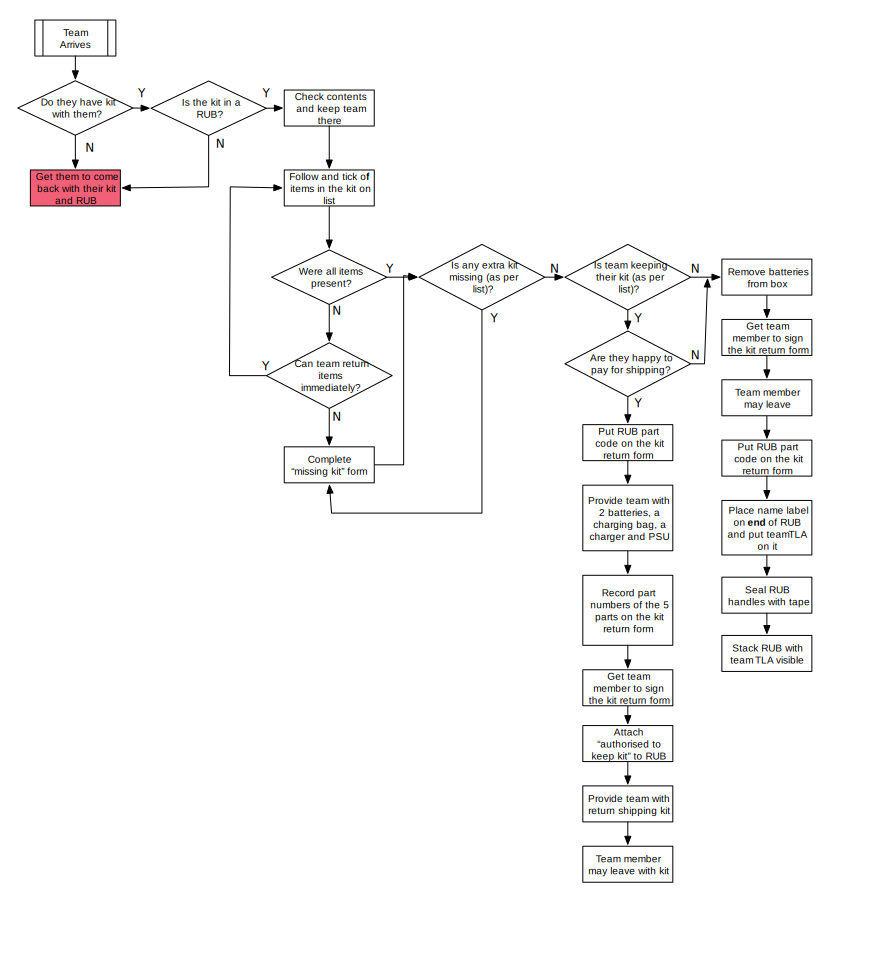

# Kit Return Volunteer

Kit return staff are responsible for receiving kit from teams at the end of the
competition and checking it. A combination of door guards and teams having to
sign out at reception should ensure that kit return staff do not have to
actively solicit kit from teams: they should present it to the staff.

Kit should only be accepted when it is placed in a RUB: loose kit should be
rejected. When presented with a RUB full of kit, kit return staff should:

**Don't let people leave the competition for good with any kit if they aren't on the list of teams authorised to keep their kit**

* For teams returning their kit (the majority of teams):
    * Check the contents against a list of parts expected in the kit.
     Make all reasonable attempts to retrieve kit there and then i.e. if they've left a bit upstairs they go and get it.
    * If they do not have something, record it on a missing kit form.
    * If the kit return form indicates that they have more than a normal kit to return (i.e. they had broken kit and did not return it upon arrival), see if they can return it now. If not, record it on a missing kit form.
    * Indicate if all parts are present or if a missing kit form has been filled in on the kit return form (provided by me).
    * Write down the part code of the Really Useful Box on the kit return form.
    * Get their team leader to sign and write their name on the kit return form.

* For teams keeping their kit (based on a list of teams authorised to do this):
    * Write down the part code of the Really Useful Box on the kit return form.
    * Give them two batteries, a battery charging bag and a charger+PSU. Record the part numbers of these five things on the kit return form.
    * Get their team leader to sign and write their name on the kit return form.
    * Stick the appropriate 'authorised to keep kit' sheet onto the kit of the Really Useful Box with tape.

* For each returned kit:
    * Remove any batteries from the kit and store them separately
    * Seal the handles of the kit with tape
    * Stick a post-it on the end of the box with the team's TLA on it (to allow for double checking later on)
    * Stack the box with the post-it visible

    
This workflow is shown in the diagram below.

## License

This work is licensed under the Creative Commons
Attribution-ShareAlike 4.0 International License. To view a copy of
this license, visit http://creativecommons.org/licenses/by-sa/4.0/.

This work is based on work done by Jeremy Morse, which was under the
Creative Commons Attribution 4.0 License.  To view a copy of this
license, visit https://creativecommons.org/licenses/by/4.0/.
