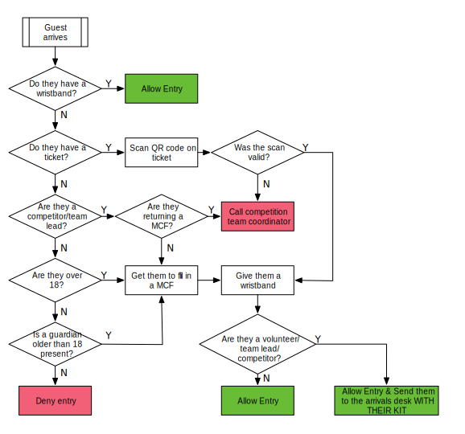

# Reception Volunteer

Reception staff control entry to the building and validate people's competition
tickets and/or wristbands. Each reception staffer has a desk, chair, and
computer.

There are four flavours of visitor to the competition: competitors,
team-leaders, volunteers and true-visitors. **Everyone** must complete a media consent form (MCF). Under 18's must have this form completed by a parent or guardian.

When someone enters the building, you should follow the procedure below.

**Note: Training on how to use the scanning software will be given on the morning by the competition team coordinator.**

At the start of the competition day, there will be four reception staffers
covering the entrance. Once the initial influx of people is complete, this
will reduce to two. Additionally, after the initial influx, receptionists
should allow people wearing SR wristbands to enter the building at will (they
should check that people walking in have one, or follow the procedure above).

Throughout the competition reception staffers will encounter a variety of
members of the public enquiring what the event is, or otherwise receiving
questions. Please answer as fully as possible, but refer any technical questions
to helpdesk, or other unknown matters to other people in SR. Any member
of the public should be allowed into the building if they sign a media consent
form.

After the initial influx of people, the 'crimper' and 'arrival-desk' roles
will be absorbed by the receptionist. If you have a time slot after the first
slot of the day, read those roles too.

## License

This work is licensed under the Creative Commons
Attribution-ShareAlike 4.0 International License. To view a copy of
this license, visit http://creativecommons.org/licenses/by-sa/4.0/.

This work is based on work done by Jeremy Morse, which was under the
Creative Commons Attribution 4.0 License.  To view a copy of this
license, visit https://creativecommons.org/licenses/by/4.0/.
